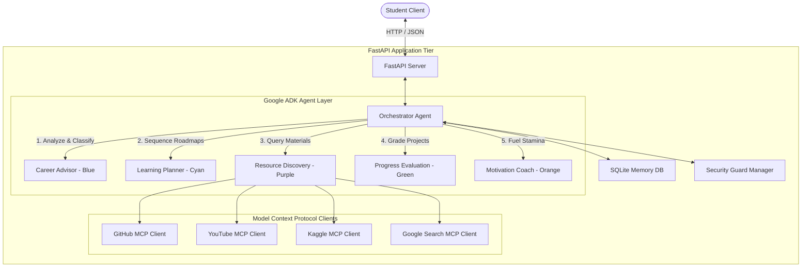

# EduPilot AI System Architecture

This document describes the internal engineering, multi-agent orchestration, and component topologies that power the **EduPilot AI** platform.

---

## Component Topology

EduPilot AI uses a split-tier architecture consisting of a Python FastAPI backend and a Next.js (App Router) React web application frontend:

---

## 1. Multi-Agent Orchestration Workflow

EduPilot AI leverages a **Single Director, Multiple Specialists** paradigm using the **Google ADK** (Agent Development Kit) framework:

1. **Request Interception:** The `Orchestrator` intercept client prompts.
2. **Security Verification:** The prompt is passed to the `SecurityManager` for prompt injection sanitization.
3. **Dynamic Routing:** The Orchestrator applies heuristic semantic analyzers to determine which sub-agent(s) should execute. 
4. **Cascading / Sequential Execution:** If the prompt matches onboarding parameters (e.g., *"I want to learn machine learning"*), the Orchestrator initiates a cascading execution flow:
   - **Career Advisor (Blue)** assigns the target path.
   - **Learning Planner (Cyan)** creates a 3-step syllabus roadmap and saves milestones to the database.
   - **Resource Discovery (Purple)** queries MCP interfaces to find initial study resources.
5. **Output Aggregation:** The Orchestrator gathers output responses from the active sub-agents and compiles a unified markdown report.

---

## 2. Agent Specifications & Visual Design Palette

To make the multi-agent execution pipeline instantly understandable on the visual graph dashboard, each specialized agent is assigned a consistent color palette:

| Agent | Brand Color | Hex Code | Primary Mandate |
| :--- | :--- | :--- | :--- |
| **Career Advisor** | Electric Blue | `#3B82F6` | Analyzes student interests and suggests job fields. |
| **Learning Planner** | Cyan Glow | `#06B6D4` | Sequences roadmaps and constructs checklist milestones. |
| **Resource Discovery** | Royal Purple | `#A855F7` | Interacts with external MCP servers for code templates and tutorials. |
| **Progress Evaluation** | Forest Green | `#22C55E` | Grades project code submissions and creates conceptual tests. |
| **Motivation Coach** | Solar Orange | `#F97316` | Computes velocity metrics and pushes streak retention quotes. |

---

## 3. Persistent Memory Layer

EduPilot AI isolates student data and state through an SQLite database. Data isolation is strictly enforced using a unique `session_id` key:
- **`sessions` table:** Tracks target role, skill tier, and custom profile tags.
- **`messages` table:** Maintains multi-turn conversation logs and tracks which sub-agents responded.
- **`milestones` table:** Holds roadmap syllabus steps with checkboxes and scores.
- **`completed_projects` table:** Tracks evaluation logs, ratings, and code reviews.

---

## 4. Security Framework & Safelands

To prevent prompt hijacking and ensure safe local executions:
1. **Prompt Injection Scanner:** Scans user inputs using regex expressions to block prompt bypass attempts (e.g., *"Ignore previous instructions..."*).
2. **Access Control Matrix:** Enforces checking rules so that sub-agents can only invoke their permitted tools (e.g., the Motivation Coach cannot toggle milestone checkboxes or call Github MCP search tools).
3. **Parameter Sanitization:** Strips path traversals (`../`) and command chaining arguments (`&&`, `;`, `|`) from parameters before invoking tools.
