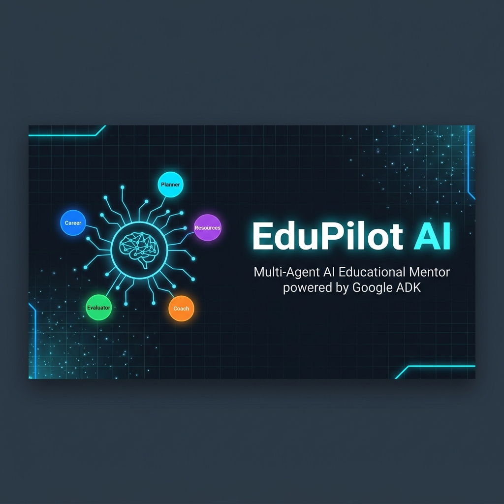
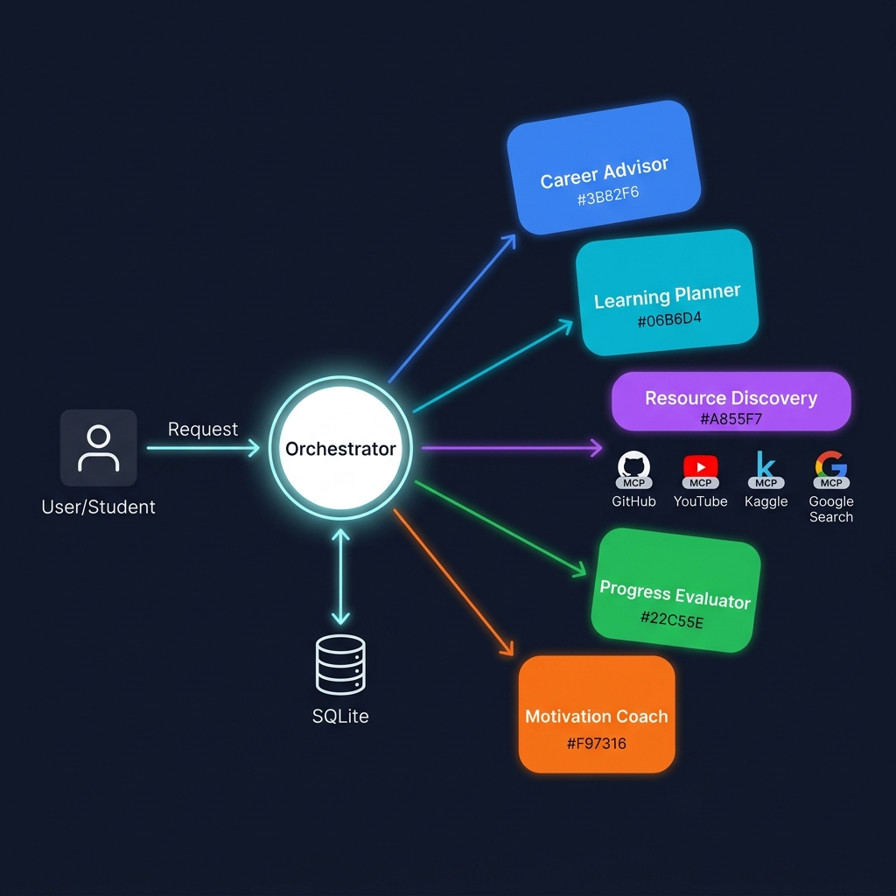
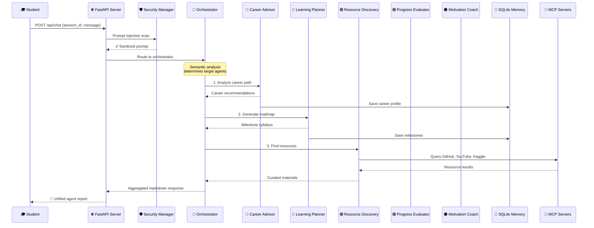
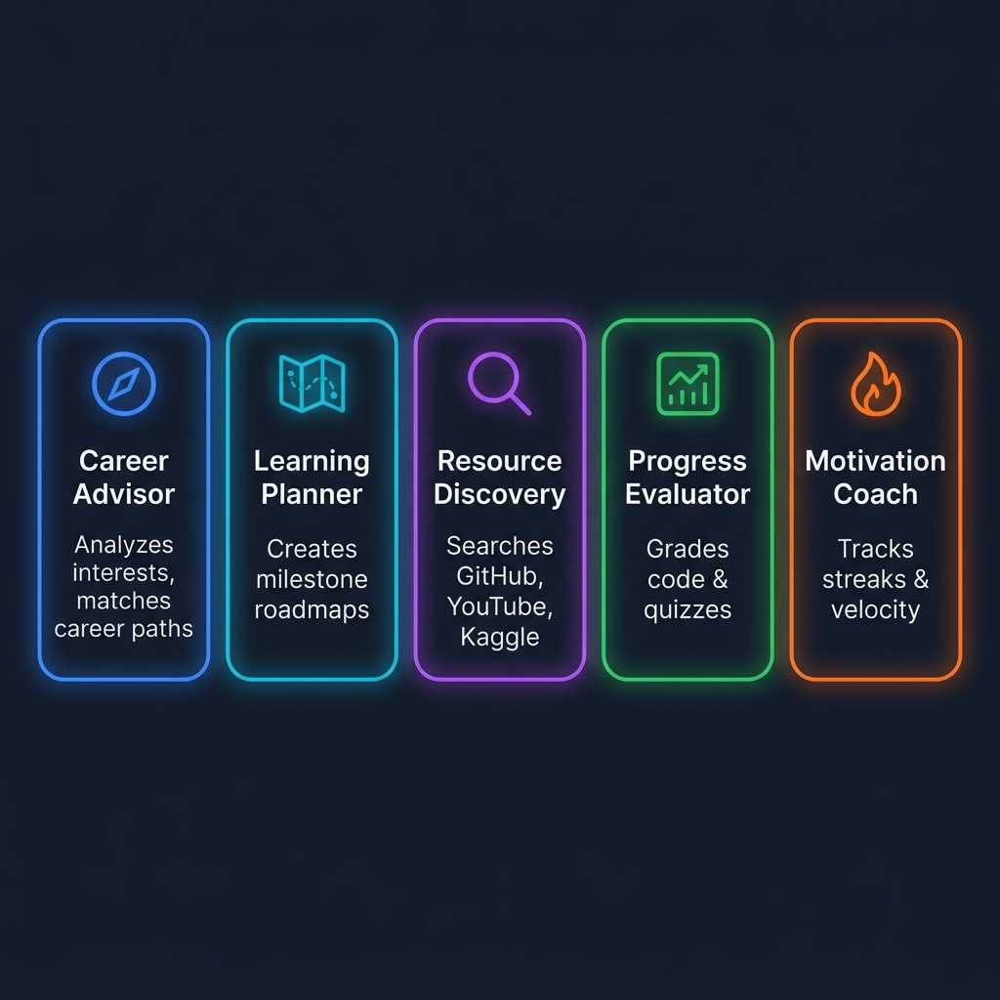
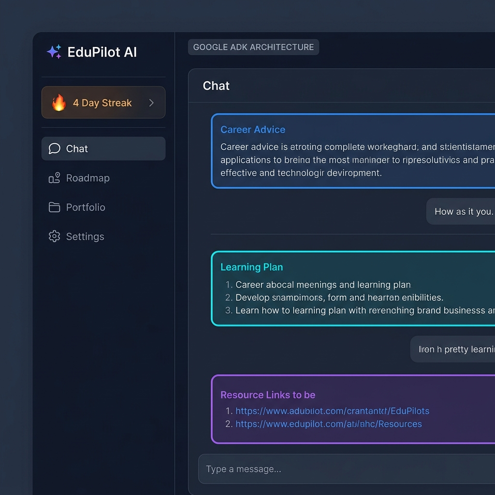

<p align="center">
  
</p>

<h1 align="center">🚀 EduPilot AI</h1>

<p align="center">
  <strong>A production-ready, multi-agent AI educational mentoring platform powered by Google ADK</strong>
</p>

<p align="center">
  <a href="#-features"></a>
  <a href="#-tech-stack"></a>
  <a href="#-tech-stack"></a>
  <a href="#-tech-stack"></a>
  <a href="#-tech-stack"></a>
  <a href="#-setup--running"></a>
</p>

<p align="center">
  <a href="#-architecture--workflow">Architecture</a> •
  <a href="#-features">Features</a> •
  <a href="#-specialized-ai-agents">Agents</a> •
  <a href="#-dashboard-preview">Dashboard</a> •
  <a href="#-setup--running">Setup</a> •
  <a href="#-api-reference">API</a> •
  <a href="#-contributing">Contributing</a>
</p>

---

## 📖 About

**EduPilot AI** is a portfolio-quality, multi-agent educational mentoring system that utilizes the **Google ADK** (Agent Development Kit) framework to provide students with a complete AI-powered learning lifecycle manager. From career discovery to roadmap generation, resource curation, project grading, and motivation tracking — EduPilot AI orchestrates 5 specialized AI agents that work together to guide students toward their professional goals.

> 💡 **Built with the "Single Director, Multiple Specialists" paradigm** — a central Orchestrator agent intelligently routes student prompts to the most relevant specialized sub-agents, enabling cascading multi-agent workflows for complex educational tasks.

---

## ✨ Features

| Feature | Description |
| :--- | :--- |
| 🧭 **Career Guidance** | Analyzes student skills and interests to match them with optimal tech career paths |
| 🗺️ **Learning Roadmaps** | Generates milestone-based syllabus roadmaps with checkable progress tracking |
| 🔍 **Resource Discovery** | Searches YouTube, GitHub, Kaggle, and Google via MCP server integrations |
| 📈 **Code Evaluation** | Grades project code submissions and creates conceptual retention quizzes |
| ⚡ **Motivation Tracking** | Monitors learning velocity, streak counters, and delivers encouragement |
| 🧠 **Persistent Memory** | SQLite-backed session isolation preserving roadmaps, messages, and evaluations |
| 🛡️ **Multi-Tier Security** | Prompt injection scanners, tool permission matrices, and parameter sanitization |
| 🎨 **Premium Dashboard** | Dark-themed Next.js UI with real-time agent routing visualization |
| 🐳 **Docker Ready** | Full multi-container deployment with `docker-compose up --build` |
| 🔄 **Mock Mode** | Built-in simulation fallbacks for testing without API keys |

---

## 🏗️ Architecture & Workflow

<p align="center">
  
</p>

### Multi-Agent Orchestration Pipeline

EduPilot AI leverages a **Single Director, Multiple Specialists** paradigm using the Google ADK framework. Here's how every student request flows through the system:



### Step-by-Step Workflow

| Step | Phase | Description |
| :---: | :--- | :--- |
| **1** | 🛡️ Security Interception | User prompt is scanned for injection attacks, path traversals, and command chaining |
| **2** | 🧠 Semantic Routing | Orchestrator analyzes prompt semantics to determine which sub-agents should execute |
| **3** | 🔵 Career Analysis | Career Advisor matches student interests to tech career fields |
| **4** | 🔷 Roadmap Generation | Learning Planner creates a 3-step milestone syllabus and saves to database |
| **5** | 🟣 Resource Search | Resource Discovery queries MCP interfaces (GitHub, YouTube, Kaggle, Google) |
| **6** | 🟢 Code Evaluation | Progress Evaluator grades submitted code and generates feedback |
| **7** | 🟠 Motivation Boost | Motivation Coach computes velocity metrics and delivers encouragement |
| **8** | 📄 Output Aggregation | Orchestrator compiles all sub-agent outputs into a unified markdown report |

---

## 🤖 Specialized AI Agents

<p align="center">
  
</p>

Each specialized agent has a designated color palette for instant visual identification in the dashboard routing graph:

| Agent | Brand Color | Hex | Role | Key Capabilities |
| :--- | :--- | :---: | :--- | :--- |
| **🧭 Career Advisor** | Electric Blue | `#3B82F6` | Career path analyst | Skills assessment, job market matching, career roadmap suggestions |
| **🗺️ Learning Planner** | Cyan Glow | `#06B6D4` | Syllabus architect | Milestone creation, learning sequencing, progress checkpoints |
| **🔍 Resource Discovery** | Royal Purple | `#A855F7` | Material curator | GitHub repos, YouTube tutorials, Kaggle datasets, Google search via MCP |
| **📈 Progress Evaluator** | Forest Green | `#22C55E` | Code grader | Project code review, conceptual quizzes, score + feedback generation |
| **⚡ Motivation Coach** | Solar Orange | `#F97316` | Streak manager | Velocity metrics, streak tracking, motivational quotes, retention boosts |

### MCP Server Integrations

The **Resource Discovery** agent connects to external data sources through Model Context Protocol (MCP) clients:

| MCP Client | Source | Purpose |
| :--- | :--- | :--- |
| 🐙 **GitHub MCP** | GitHub API | Search repositories, code templates, and open-source projects |
| 📺 **YouTube MCP** | YouTube Data API | Find tutorial videos and educational content |
| 📊 **Kaggle MCP** | Kaggle API | Discover datasets and competition notebooks |
| 🔎 **Google Search MCP** | Google Search | General web resource discovery |

---

## 🖥️ Dashboard Preview

<p align="center">
  
</p>

The premium dark-themed dashboard features:
- **🗨️ AI Mentor Chat** — Color-coded agent responses with real-time routing visualization
- **🗺️ Milestone Roadmaps** — Interactive checklists with evaluator feedback and scores
- **🏆 Graded Portfolio** — Project submissions with code reviews and grade cards
- **⚙️ System Settings** — Toggle mock mode, switch Gemini models, configure API endpoints
- **🔥 Learning Velocity** — Streak counter and study consistency tracker
- **📊 Agent Routing Graph** — Live visualization of which agents are processing your request

---

## 📂 Project Structure

```
EduPilotAI/
├── 📁 backend/
│   ├── 📁 app/
│   │   ├── 📁 agents/
│   │   │   ├── career_advisor.py        # 🔵 Career Agent (Electric Blue)
│   │   │   ├── learning_planner.py      # 🔷 Planner Agent (Cyan Glow)
│   │   │   ├── resource_discovery.py    # 🟣 Resource Agent (Royal Purple)
│   │   │   ├── progress_evaluation.py   # 🟢 Evaluator Agent (Forest Green)
│   │   │   ├── motivation_coach.py      # 🟠 Coach Agent (Solar Orange)
│   │   │   └── orchestrator.py          # 🧠 Multi-agent Director/Router
│   │   ├── config.py                    # App configuration & environment variables
│   │   ├── main.py                      # FastAPI entrypoint & REST endpoints
│   │   ├── mcp_clients.py              # YouTube/GitHub/Kaggle/Google MCP wrappers
│   │   ├── memory.py                    # SQLite persistence & user data isolation
│   │   ├── schemas.py                   # Pydantic request/response models
│   │   └── security.py                  # Prompt injection & tool permission matrices
│   ├── 📁 tests/
│   │   └── test_agents.py              # Pytest agent/routing test suites
│   ├── requirements.txt                 # Python backend dependencies
│   └── Dockerfile                       # FastAPI production build recipe
├── 📁 frontend/
│   ├── 📁 app/
│   │   ├── globals.css                  # Custom neon glows and scrollbar styling
│   │   ├── layout.tsx                   # Root metadata & Google font loaders
│   │   └── page.tsx                     # Premium Slate-style React Dashboard UI
│   ├── package.json                     # Node.js dependencies
│   ├── tailwind.config.js              # Theme extend configs (Electric Blue/Cyan)
│   └── Dockerfile                       # Next.js production build recipe
├── 📁 assets/                           # README images and diagrams
├── docker-compose.yml                   # Full multi-container composition
├── demo_script.py                       # Local multi-agent routing simulation
├── README.md                            # This file
├── ARCHITECTURE.md                      # Deep technical component analysis
└── SETUP.md                             # Detailed development setup manual
```

---

## 🛠️ Tech Stack

| Layer | Technology | Purpose |
| :--- | :--- | :--- |
| **AI Framework** | Google ADK (Agent Development Kit) | Multi-agent orchestration & tool calling |
| **LLM** | Google Gemini 2.5 Flash / Pro | Natural language understanding & generation |
| **Backend** | Python FastAPI | REST API server with async support |
| **Frontend** | Next.js (App Router) + React | Premium dark-themed dashboard UI |
| **Styling** | Tailwind CSS | Utility-first responsive design |
| **Database** | SQLite | Persistent session memory & milestone tracking |
| **Protocols** | Model Context Protocol (MCP) | External resource server integrations |
| **Containers** | Docker + Docker Compose | Multi-container deployment |
| **Testing** | Pytest | Agent routing & integration tests |

---

## 🚀 Setup & Running

### Prerequisites

- **Python 3.10+** (Required by Google ADK)
- **Node.js 18+** & **npm**
- **Docker** & **Docker Compose** (Optional, for containerized deployment)

### Option 1: Docker Compose (Recommended)

```bash
# Clone the repository
git clone https://github.com/EshaanSharma/EduPilotAI.git
cd EduPilotAI

# Start the entire platform
docker-compose up --build
```

| Service | URL |
| :--- | :--- |
| 🌐 Frontend Dashboard | `http://localhost:3000` |
| ⚡ Backend API | `http://localhost:8000` |
| 📖 API Docs (Swagger) | `http://localhost:8000/docs` |

### Option 2: Local Development

#### Backend Setup
```bash
cd backend
python -m venv venv

# Windows
.\venv\Scripts\activate
# Linux/macOS
source venv/bin/activate

pip install -r requirements.txt
uvicorn app.main:app --reload --host 127.0.0.1 --port 8000
```

#### Frontend Setup
```bash
cd frontend
npm install
npm run dev
```

### Environment Variables

Create a `.env` file inside the `backend/` directory:

```env
# Google Gemini API Key (Required for live ADK agents)
GEMINI_API_KEY=your_gemini_api_key_here

# Enable/Disable Mock Fallbacks (set to true for testing without API keys)
MOCK_MODE=true

# Google ADK Target Model
GEMINI_MODEL=gemini-2.5-flash

# Optional: MCP Server Tokens for live Search/GitHub tools
GITHUB_TOKEN=your_github_token
YOUTUBE_API_KEY=your_youtube_api_key
KAGGLE_USERNAME=your_kaggle_username
KAGGLE_KEY=your_kaggle_key
```

> 💡 **Tip:** Set `MOCK_MODE=true` to test the full multi-agent pipeline with simulated responses — no API keys needed!

---

## 🧪 Testing

```bash
# Run the full test suite
python -m pytest backend/tests/ -v

# Run the local CLI simulation demo
python demo_script.py
```

---

## 🔌 API Reference

| Method | Endpoint | Description |
| :---: | :--- | :--- |
| `POST` | `/api/chat` | Process a message through the multi-agent orchestrator |
| `GET` | `/api/sessions/{session_id}` | Fetch session profile, target role, and roadmap status |
| `GET` | `/api/sessions/{session_id}/history` | Retrieve full conversation history logs |
| `GET` | `/api/sessions/{session_id}/milestones` | List active roadmap milestones and completion status |
| `POST` | `/api/milestones/{milestone_id}/toggle` | Toggle milestone completion with score and feedback |
| `GET` | `/api/sessions/{session_id}/projects` | Return graded project submissions and scores |
| `GET` | `/api/settings` | Get current `mock_mode` and model configuration |
| `POST` | `/api/settings` | Update backend runtime parameters |

### Example: Chat Request

```bash
curl -X POST http://localhost:8000/api/chat \
  -H "Content-Type: application/json" \
  -d '{
    "session_id": "student_001",
    "message": "I want to become a Machine Learning Engineer"
  }'
```

### Example: Response
```json
{
  "response": "### 🧭 Career Guidance\n\nBased on your interests, I recommend...\n\n### 🗺️ Learning Roadmap\n\n**Milestone 1:** Python Data Science Foundations...",
  "execution_logs": [
    {"agent": "Career Advisor", "status": "completed", "color": "blue"},
    {"agent": "Learning Planner", "status": "completed", "color": "cyan"},
    {"agent": "Resource Discovery", "status": "completed", "color": "purple"}
  ]
}
```

---

## 🛡️ Security Framework

EduPilot AI implements a multi-layered security architecture:

| Layer | Mechanism | Description |
| :--- | :--- | :--- |
| **Prompt Injection Scanner** | Regex pattern matching | Blocks bypass attempts like *"Ignore previous instructions..."* |
| **Access Control Matrix** | Per-agent tool permissions | Each agent can only invoke its permitted tools |
| **Parameter Sanitization** | Path traversal stripping | Removes `../`, `&&`, `;`, `\|` from tool parameters |

---

## ☁️ Deployment

### Railway
1. Connect your GitHub repository to Railway
2. Railway auto-detects the `docker-compose.yml` or standard buildpacks
3. Configure `GEMINI_API_KEY` and `MOCK_MODE` in the Railway dashboard
4. Set `NEXT_PUBLIC_API_URL` to your Railway backend URL

### Google Cloud Run
```bash
# Build and push the backend container
docker build -t gcr.io/your-project-id/edupilot-backend ./backend
docker push gcr.io/your-project-id/edupilot-backend
gcloud run deploy edupilot-backend \
  --image gcr.io/your-project-id/edupilot-backend \
  --platform managed \
  --allow-unauthenticated
```

---

## 🤝 Contributing

Contributions are welcome! Here's how to get started:

1. **Fork** the repository
2. **Create** a feature branch: `git checkout -b feature/amazing-feature`
3. **Commit** your changes: `git commit -m 'Add amazing feature'`
4. **Push** to the branch: `git push origin feature/amazing-feature`
5. **Open** a Pull Request

---

## 📄 License

This project is open-source and available under the [MIT License](LICENSE).

---

<p align="center">
  <strong>Built with ❤️ using Google ADK, FastAPI, and Next.js</strong>
  <br />
  <sub>⭐ Star this repo if you find it helpful!</sub>
</p>
