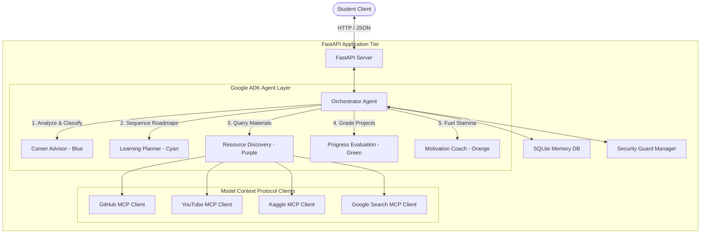
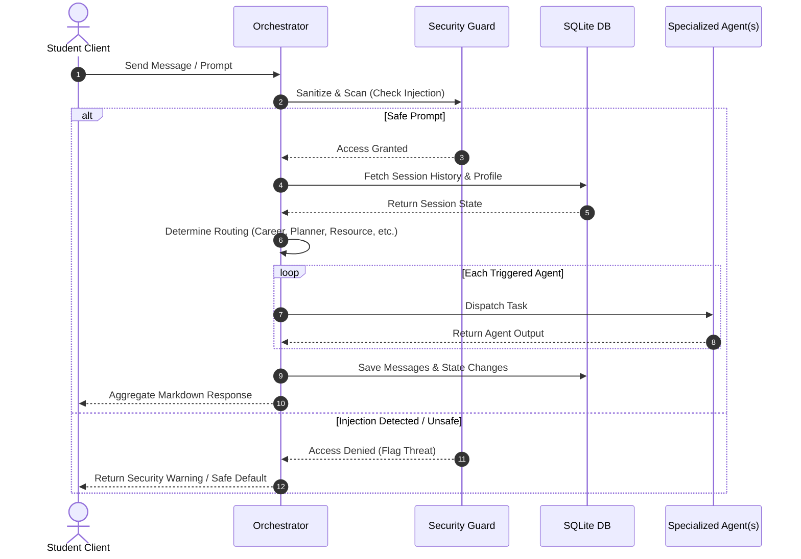
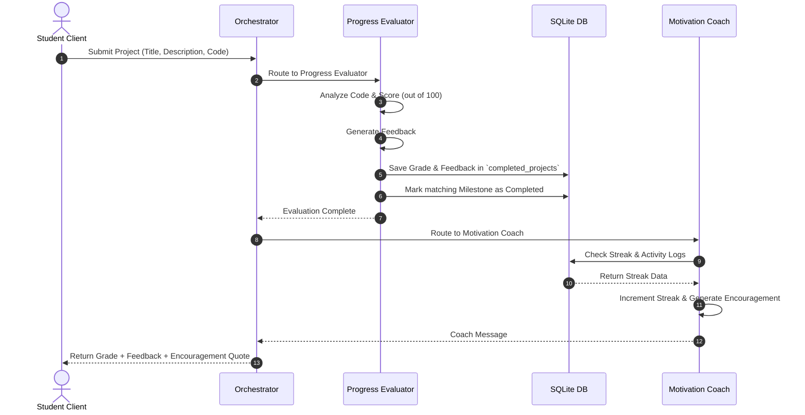
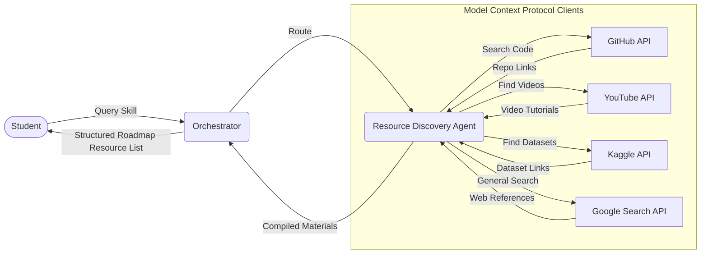

# EduPilot AI - Project Specifications & Workflows

EduPilot AI is a state-of-the-art, multi-agent student mentoring and career roadmap acceleration platform. Built on the **Google Agent Development Kit (ADK)** framework, the system coordinates multiple AI specialist agents under a single Orchestrator to guide students, manage roadmap syllabi, supply external learning resources via Model Context Protocol (MCP) clients, and grade student portfolios.

---

## System Architecture Overview

---

## 1. Onboarding & Multi-Agent Routing Flow

The Orchestrator intercepts student prompts and coordinates dynamic routing to specialized sub-agents. It uses a **Single Director, Multiple Specialists** paradigm to execute workflows sequentially or conditionally depending on the user's intent.

---

## 2. Project Evaluation & Portfolio Grading Pipeline

When a student submits a coding task or milestone project for review, the Orchestrator invokes the **Progress Evaluator** to grade the code and the **Motivation Coach** to update their learning streak metrics.

---

## 3. Resource Discovery & MCP Integration Flow

The **Resource Discovery** agent connects to external resources using Model Context Protocol (MCP) clients to fetch real-world data like repositories, playlists, datasets, or search terms matching the student's study plan.

---

## Agent Roles & Visual Branding Guidelines

To represent routing live on the dashboard UI, each agent is mapped to a distinct color code and UI badge:

| Agent | Brand Color | Hex Code | Primary Mandate |
| :--- | :--- | :--- | :--- |
| **Career Advisor** | Electric Blue | `#3B82F6` | Analyzes student interests and suggests target roles. |
| **Learning Planner** | Cyan Glow | `#06B6D4` | Generates 3-step checklist milestones and custom syllabi. |
| **Resource Discovery** | Royal Purple | `#A855F7` | Integrates with external MCP servers for code & tutorials. |
| **Progress Evaluator** | Forest Green | `#22C55E` | Grades project code submissions and provides technical reviews. |
| **Motivation Coach** | Solar Orange | `#F97316` | Manages learning streaks, activity counts, and motivational quotes. |
